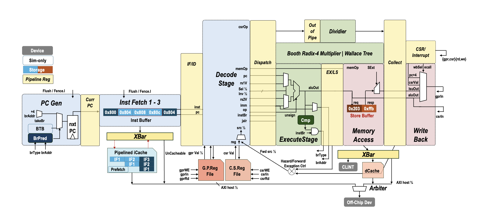

# 1GHz HiFreq RV32IM In-Order CPU in Chisel

Forked from [CAS「一生一芯」Project](https://github.com/OSCPU/ysyx-workbench).

This framework includes

- **NPC** (New Processor Core), an **1GHz** pipelined RISC-V processor core in **Chisel**:
  - `RV32IM_Zifencei_Zicsr` in this `scalar-rv32im` branch.
  - M-Mode exception/interrupt handling, **RT-Thread capable**
  - An 3-cycle multiplier and out-of-pipeline divider for integer operations.
  - Branch prediction support (bimodal, BTFNT, or none) with return address stack.
  - Configurable iCache/dCache with 3-cycle read latency.
  - AXI interconnect to rocket-chip-based SoC
- **NEMU** (NJU EMUlator), a reference RV32IM emulator in C:
  - Used as **ref** for functional correctness verification of NPC via DiffTest
  - Used as a trace generator for npSim timing simulator.
- **npSim** ([NPC Simulator](https://github.com/Hypersonic-cpu/ysyx-npSim)), a trace-driven timing simulator in C++:
  - Simulates NPC execution with IPC error `<5%`
  - Provides detailed performance statistics
  - `~50x` faster than RTL simulation.

## NPC: Tape-out parts - core and L1 caches

### Overview



### Configuration

| Config        | Default    | Options             | Description                                           |
| ------------- | ---------- | ------------------- | ----------------------------------------------------- |
| `--config-{}` | `extended` | `extended`          | `extended` for RV32IM with dCache                     |
| `--soc-mode`  | false      | set (store true)    | Using SoC and devices, otherwise DPI-C memory         |
| `--sramlib`   | deprecated | ctrl by `--config-` | Use OpenRAM for SRAM model, otherwise fallback to DFF |
| `--no-debug`  | not set    | set (store true)    | Disable debug and software PMU related wires          |

### Parameters

Key configurable parameters in `rvproc/src/IsaParams.scala`:

| Parameter    | CmdLine         | Default | Range                    | Description                                                |
| ------------ | --------------- | ------- | ------------------------ | ---------------------------------------------------------- |
| `bpType`     | `--bp-{name}`   | bimodal | `{none, btfnt, bimodal}` | Branch prediction: none, BTFNT, or bimodal                 |
| `bpEntries`  | `--bp-entries`  | 256     | 2–4096, pow-of-2         | Branch predictor history table (saturation conter) entries |
| `btbEntries` | `--btb-entries` | 128     | 2–512, pow-of-2          | Branch target buffer (BTB) size                            |
| `rasSize`    | `--ras-size`    | 8       | 1–32                     | Return address stack depth                                 |
| `l1iSize`    | `--l1i-size`    | 2048    | 256–8192, pow-of-2       | I-cache size (bytes)                                       |
| `l1iBlksize` | `--l1i-blksize` | 16      | 8–64, pow-of-2           | I-cache line width (bytes)                                 |
| `l1dSize`    | `--l1d-size`    | 1024    | 256–4096, pow-of-2       | D-cache size (bytes)                                       |
| `l1dBlksize` | `--l1d-blksize` | 16      | 8–64, pow-of-2           | D-cache line width (bytes)                                 |

Pass the params above to Makefile via `RTL_SCALA_ARG` variable:

```bash
make verilog RTL_SCALA_ARG="--l1i-size 512 --l1i-blksize 32"
make rtlsta  RTL_SCALA_ARG="--l1d-size 2048 --bp-none"
```

### Performance

**CoreMark**: **1538 @ 1GHz** (RV32IM, default configuration)

- Measured on NANGATE45 technology node
- Baseline cache: L1I=2KB/16B, L1D=1KB/16B
- Branch predictor: Bimodal with 256 entries, 128 BTBs.
- Single-core, in-order execution

Performance is sensitive to cache configuration (I-cache miss latency dominates CoreMark execution for RV32IM).

```bash
cd am_kernels/coremark && \
  make ARCH=riscv32im-ysyxsoc DIFFENA=0 DBGENA=1 \
  RTL_SCALA_ARG="--config-extended" run
```

### Design Details

1. Clear `PCGen->IF{1-3}->ID->EX->MEM->WB` pipeline with registered handshake between stages via Chisel `DecoupledIO`,
   suitable for DiffTest validation.

1. **Front-end**
   - Bimodal branch predictor with 2-bit saturating counters
   - Return Address Stack (RAS) for predicting function returns
   - 3-cycle (recv, tag-compare, resp) pipelined instruction cache, throughtput of 1 inst/cyc

1. **Functional Units**
   - 3-cycle pipelined integer multiplier (Booth Radix-4, Wallace, Adder), out-of-pipeline divider
   - Out-of-order completion of mul/div with dispatcher WAW hazard control
   - Forwarding from EX/MEM and MEM/WB to ID/EX for ALU and load/store instructions

1. **Memory Hierarchy**
   - Use `iSplit` and `dSplit` micro-xbar for address mapping
   - SRAM blackbox support for synthesis-ready designs

1. **SoC Integration**
   - Provide CLINT (Core Local Interruptor) for timer
   - **APB and AXI4 delayer** for correct timing with single-clock-domain simulator (like Verlitor)
   - AXI4 master/slave interfaces for bus communication
   - Standalone simulation mode (PMemBox DPI-C) and SoC mode (external SDRAM/Flash)

## Design Framework

The structure is as follows:

```
ysyx-workbench/
├── abstract-machine   # Runtime and link scripts
│   ├── am             # Device support
│   ├── klib           # Hardware-related header files
│   └── # other
├── am-kernels         # Benchmark and test workload
│   ├── benchmarks
│   ├── kernels
│   └── tests
├── nemu               # RV32IM emulator, also used as ref in RTL verification (DiffTest)
├── npc                # NeoProcessorCore (NPC) in Chisel
│   ├── build.mill
│   ├── libs
│   ├── README.md
│   └── rvproc
│       ├── constr     # NVBoard (a virtual FPGA board) pin assignment
│       ├── dpic       # Verilator DPI-C related
│       ├── MakeTest.mk
│       ├── sim-cxx    # Verilator driving files and RTL perf statistics
│       └── src        # Chisel .scala files
├── npsim              # Timing simulator, use the trace generated by NEMU
├── nvboard            # Virtual FPGA
├── README.md
├── rt-thread-am       # RT-Thread OS
│   ├── AUTHORS
│   ├── bsp            # Context switch & ecall support
│   └── # others
└── ysyxSoC            # SoC integration, including SDRAM/Flash sim model
```
