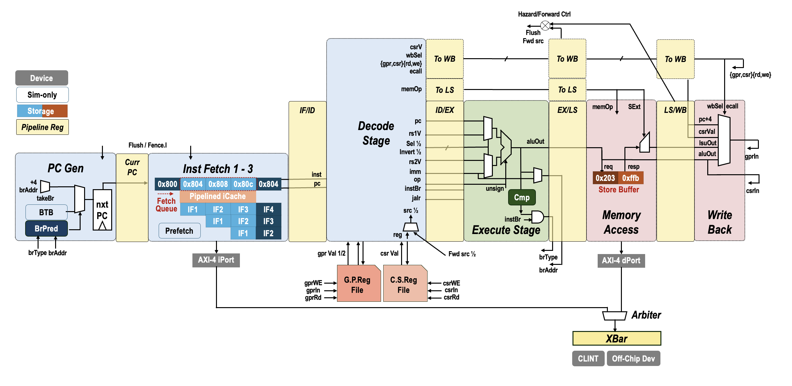

j# CAS「一生一芯」Project: RISC-V Core Design Framework

Forked from [一生一芯](https://github.com/OSCPU/ysyx-workbench).

This framework includes

- **NPC** (New Processor Core), an **1GHz** pipelined RISC-V processor core in **Chisel**:
  - `RV32IM_Zifencei_Zicsr` in this `scalar-rv32im` branch.
  - An 2-cycle multiplier and out-of-pipeline divider for integer operations.
  - Configurable iCache/dCache with 3-cycle read latency.
  - Branch prediction support (bimodal, BTFNT, or none) with return address stack.
  - AXI interconnect to rocket-chip-based SoC
- **NEMU** (NJU EMUlator), a reference RV32IM emulator in C:
  - Used as **ref** for functional correctness verification of NPC via DiffTest
  - Used as a trace generator for npSim timing simulator.
- **npSim** (NPC Simulator), a trace-driven timing simulator in C++:
  - Simulates NPC execution with IPC error `<5%`
  - Provides detailed performance statistics
  - `~50x` faster than RTL simulation.

## NPC: HiFreq RV32IM Pipelined Core in Chisel

### Overview



### Configuration

| Config        | Default    | Options             | Description                                           |
| ------------- | ---------- | ------------------- | ----------------------------------------------------- |
| `--config-{}` | `extended` | `extended`          | `extended` for RV32IM with dCache                     |
| `--soc-mode`  | false      | set (store true)    | Using SoC and devices, otherwise DPI-C memory         |
| `--sramlib`   | deprecated | ctrl by `--config-` | Use OpenRAM for SRAM model, otherwise fallback to DFF |
| `--no-debug`  | not set    | set (store true)    | Disable debug and software PMU related wires          |

### Parameters

Key configurable parameters in `rvproc/src/IsaParams.scala`:

| Parameter    | CmdLine         | Default | Range                    | Description                                                |
| ------------ | --------------- | ------- | ------------------------ | ---------------------------------------------------------- |
| `bpType`     | `--bp-{name}`   | bimodal | `{none, btfnt, bimodal}` | Branch prediction: none, BTFNT, or bimodal                 |
| `bpEntries`  | `--bp-entries`  | 256     | 2–4096, pow-of-2         | Branch predictor history table (saturation conter) entries |
| `btbEntries` | `--btb-entries` | 128     | 2–512, pow-of-2          | Branch target buffer (BTB) size                            |
| `rasSize`    | `--ras-size`    | 8       | 1–32                     | Return address stack depth                                 |
| `l1iSize`    | `--l1i-size`    | 2048    | 256–8192, pow-of-2       | I-cache size (bytes)                                       |
| `l1iBlksize` | `--l1i-blksize` | 16      | 8–64, pow-of-2           | I-cache line width (bytes)                                 |
| `l1dSize`    | `--l1d-size`    | 1024    | 256–4096, pow-of-2       | D-cache size (bytes)                                       |
| `l1dBlksize` | `--l1d-blksize` | 16      | 8–64, pow-of-2           | D-cache line width (bytes)                                 |

Pass the params above to Makefile via `RTL_SCALA_ARG` variable:

```bash
make verilog RTL_SCALA_ARG="--l1i-size 512 --l1i-blksize 32"
make rtlsta  RTL_SCALA_ARG="--l1d-size 2048 --bp-none"
```

### Performance

**CoreMark**: **1538 @ 1GHz** (RV32IM, default configuration)

- Measured on NANGATE45 technology node
- Baseline cache: L1I=2KB/16B, L1D=1KB/16B
- Branch predictor: Bimodal with 256 entries, 128 BTBs.
- Single-core, in-order execution

Performance is sensitive to cache configuration (I-cache miss latency dominates CoreMark execution for RV32IM).

```bash
cd am_kernels/coremark && \
  make ARCH=riscv32im-ysyxsoc DIFFENA=0 DBGENA=1 \
  RTL_SCALA_ARG="--config-extended" run
```

### Design Details

1. Clear `PCGen->IF{1-3}->ID->EX->MEM->WB` pipeline with registered handshake between stages via Chisel `DecoupledIO`, 
   suitable for DiffTest validation.

1. **Front-end**
   - Bimodal branch predictor with 2-bit saturating counters
   - Suitable for formal verification and DiffTest validation
   - Open-source Chisel HDL (human-readable, scala-based)

1. **Instruction-Level Parallelism (ILP)**
   - Load/multiply bypass forwarding reduces pipeline stalls
   - Hazard detection logic prevents data hazards

1. **Memory Hierarchy**
   - Direct-mapped caches avoid set associativity complexity while supporting dynamic reconfiguration
   - Configurable line sizes match typical SoC memory widths (32-bit base, 64-bit capable)
   - SRAM blackbox support for synthesis-ready designs

1. **SoC Integration**
   - AXI4 master/slave interfaces for bus communication
   - Standalone simulation mode (PMemBox DPI-C) and SoC mode (external SDRAM/Flash)
   - Optional interrupt support (mip/mie CSR fields)

## Design Framework

### NPC Core Implementation (`npc/rvproc/src/`)

**Pipeline Stages**

- `FetchStage.scala` — Instruction fetch, PC management, branch prediction interface
- `DecodeStage.scala` — Instruction decode, operand extraction, hazard detection input
- `ExecuteStage.scala` — ALU, branch resolution, forwarding logic
- `MemoryStage.scala` — Load/store unit, cache interface
- `WrBackStage.scala` — Register file write-back

**Execution Units**

- `IntMultiplier.scala` — 32-bit combinational/pipelined multiplier
- `IntDivider.scala` — 32-bit divider (separate pipeline)
- `RegFile.scala` — 32×32-bit register file with dual-read, single-write ports

**Cache Subsystem** (`src/cache/`)

- `iCache.scala` — Direct-mapped instruction cache with configurable size/line width
- `dCache.scala` — Direct-mapped data cache with write-back policy
- `Prefetcher.scala` — Optional prefetch logic
- `iCachePMU.scala` — Cache performance monitoring

**Bus & Interconnect**

- `AXIBus.scala` — AXI4-Lite master/slave interface definitions
- `BusConnect.scala` — Registered handshake pipeline connectors
- `Interface.scala` — Top-level core I/O ports

**Control & Utilities**

- `HazardDet.scala` — Hazard detection and forwarding control
- `FlushCtrl.scala` — Pipeline flush on branch misprediction
- `IsaParams.scala` — ISA constants, configuration flags (Tiny/Extended, BP type)
- `ElaborConfig.scala` — Build-time argument parsing
- `Util.scala` — Common utility functions

**Core Top Module**

- `rvCore.scala` — Top-level processor integrating all stages and subsystems

**Device Interfaces**

- `device/UART.scala` — Serial communication controller
- `device/CLINT.scala` — Core-local interrupt controller (timer, software interrupts)

The structure is as follows:

```
ysyx-workbench/
├── abstract-machine   # Runtime and link scripts
│   ├── am             # Device support
│   ├── klib           # Hardware-related header files
│   └── # other
├── am-kernels         # Benchmark and test workload
│   ├── benchmarks
│   ├── kernels
│   └── tests
├── nemu               # RV32IM emulator, also used as ref in RTL verification (DiffTest)
├── npc                # NeoProcessorCore (NPC) in Chisel
│   ├── build.mill
│   ├── libs
│   ├── README.md
│   └── rvproc
│       ├── constr     # NVBoard (a virtual FPGA board) pin assignment
│       ├── dpic       # Verilator DPI-C related
│       ├── MakeTest.mk
│       ├── sim-cxx    # Verilator driving files and RTL perf statistics
│       └── src        # Chisel .scala files
├── npsim              # Timing simulator, use the trace generated by NEMU
├── nvboard            # Virtual FPGA
├── README.md
├── rt-thread-am       # RT-Thread OS
│   ├── AUTHORS
│   ├── bsp            # Context switch & ecall support
│   └── # others
└── ysyxSoC            # SoC integration, including SDRAM/Flash sim model
```

